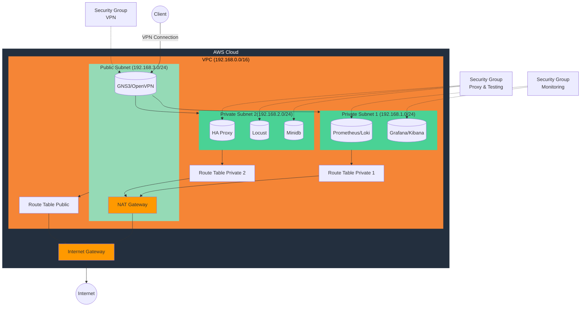

# Terraform Hub

```mermaid
graph TB
    subgraph AWS_Cloud["AWS Cloud"]
        subgraph VPC["VPC (192.168.0.0/16)"]
            subgraph Private_Subnet_1["Private Subnet 1 (192.168.1.0/24)"]
                PM[("Prometheus/Loki")]
                GK[("Grafana/Kibana")]
            end
            
            subgraph Private_Subnet_2["Private Subnet 2(192.168.2.0/24)"]
                HA[("HA Proxy")]
                LO[("Locust")]
                MD[("Minidb")]
            end
            
            subgraph Public_Subnet["Public Subnet (192.168.3.0/24)"]
                VPN[("GNS3/OpenVPN")]
                NAT["NAT Gateway"]
            end
            
            RT_PRI1["Route Table Private 1"]
            RT_PRI2["Route Table Private 2"]
            RT_PUB["Route Table Public"]
        end
        
        IGW["Internet Gateway"]
    end
    
    Internet((Internet))
    Client((Client))
    
    %% Connections
    Client -->|VPN Connection| VPN
    VPN --> Private_Subnet_1
    VPN --> Private_Subnet_2
    
    Private_Subnet_1 --> RT_PRI1
    Private_Subnet_2 --> RT_PRI2
    Public_Subnet --> RT_PUB
    
    RT_PRI1 --> NAT
    RT_PRI2 --> NAT
    NAT --> IGW
    RT_PUB --> IGW
    IGW --> Internet
    
    %% Security Group connections
    SG_MON["Security Group\nMonitoring"] -.-> PM
    SG_MON -.-> GK
    SG_VPN["Security Group\nVPN"] -.-> VPN
    SG_PROXY["Security Group\nProxy & Testing"] -.-> HA
    SG_PROXY -.-> LO
    SG_PROXY -.-> MD

    style AWS_Cloud fill:#232F3E,stroke:#232F3E,color:white
    style VPC fill:#F58536,stroke:#F58536,color:black
    style Private_Subnet_1 fill:#4AD295,stroke:#4AD295
    style Private_Subnet_2 fill:#4AD295,stroke:#4AD295
    style Public_Subnet fill:#95DAB6,stroke:#95DAB6
    style IGW fill:#FF9900
    style NAT fill:#FF9900
```